# Build Yocto Linux Image for Raspberry Pi 4

Tài liệu này ghi lại toàn bộ quá trình build một Linux image bằng **Yocto Project** cho **Raspberry Pi 4**, dựa trên quy trình thực hành trong file Word gốc: tải source code, thêm BSP layer, khởi tạo môi trường build, cấu hình `local.conf`, build image, flash vào SD card và kết nối UART.

> **Lưu ý:** Nội dung dưới đây giữ nguyên logic của tài liệu gốc, nhưng đã sửa các chỗ dễ gây nhầm như `raspberrypi3` → `raspberrypi4`, đường dẫn `meta-raspberrypi` sau khi vào thư mục `build`, và bổ sung cảnh báo khi dùng `dd`.

---

# I. Download Source Code

## 1. Clone Poky

```bash
git clone -b scarthgap https://git.yoctoproject.org/poky poky-rpi
```

Cú pháp tổng quát:

```bash
git clone -b <branch> <repository> <folder>
```

Ý nghĩa:

- `git clone`: tải một Git repository về máy.
- `-b scarthgap`: chọn branch `scarthgap`.
- `https://git.yoctoproject.org/poky`: repository của Poky.
- `poky-rpi`: thư mục sẽ chứa source code sau khi clone.

Trong hướng dẫn này sử dụng branch:

```text
scarthgap
```

Có thể chọn branch khác như `kirkstone`, `styhead`, `master`,... tùy phiên bản Yocto cần sử dụng.

### Poky là gì?

**Poky** là hệ thống tham chiếu của Yocto Project.

Poky chứa các thành phần cơ bản như:

- BitBake
- Metadata
- Các layer cơ bản
- Build configuration

Nó cung cấp nền tảng để bắt đầu build một hệ điều hành Linux bằng Yocto.

Sau khi clone, có thể kiểm tra nội dung thư mục:

```bash
cd poky-rpi
ls
```

Ảnh minh họa từ quá trình thực hành:

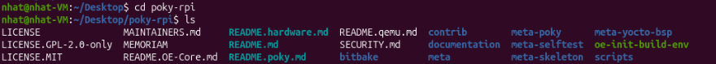

---

## 2. Clone `meta-raspberrypi`

Đảm bảo terminal đang ở thư mục:

```text
poky-rpi
```

Sau đó clone BSP layer dành cho Raspberry Pi:

```bash
git clone -b scarthgap https://github.com/agherzan/meta-raspberrypi.git
```

Ý nghĩa:

- `git clone`: tải repository.
- `-b scarthgap`: lấy branch `scarthgap` để tương thích với Poky đang sử dụng.
- `meta-raspberrypi`: metadata/BSP layer dành cho Raspberry Pi.

### Tại sao cần `meta-raspberrypi`?

Poky cung cấp nền tảng chung để build Linux, nhưng bản thân Poky không chứa đầy đủ cấu hình phần cứng riêng cho Raspberry Pi.

Ví dụ Raspberry Pi 4 có các thành phần:

- CPU/SoC BCM2711
- RAM
- GPIO
- UART
- Wi-Fi
- Bluetooth
- SD Card Controller
- USB
- Ethernet

Để Linux chạy đúng trên board, Yocto phải biết các thông tin như:

- Kernel configuration
- Device Tree
- Firmware
- Bootloader / boot files
- Machine configuration

`meta-raspberrypi` cung cấp các recipe, metadata và cấu hình cần thiết để Yocto có thể build Linux cho Raspberry Pi.

> **Quan trọng:** Clone layer về máy **không có nghĩa Yocto đã sử dụng layer đó**. Sau đó vẫn phải dùng `bitbake-layers add-layer` để đăng ký layer vào build configuration.

---

# II. Initialize Yocto/OpenEmbedded Build Environment

Sau khi clone Poky, BitBake đã có trong source code. Tuy nhiên terminal hiện tại chưa được cấu hình để gọi các công cụ build của Yocto.

Chạy:

```bash
source oe-init-build-env
```

Trong tên `oe-init-build-env`:

- `oe` = OpenEmbedded
- `init` = initialize
- `build-env` = build environment

`oe-init-build-env` là script dùng để chuẩn bị môi trường build cho OpenEmbedded/Yocto.

Lệnh:

```bash
source oe-init-build-env
```

sẽ chạy script trong shell hiện tại để:

- thiết lập các biến môi trường cần thiết;
- cho phép gọi `bitbake`, `bitbake-layers`,...;
- tạo/cấu hình thư mục build nếu cần;
- chuyển terminal vào thư mục `build`.

Khi chạy thành công sẽ xuất hiện thông báo dạng:

```text
### Shell environment set up for builds. ###
```

Ảnh minh họa:

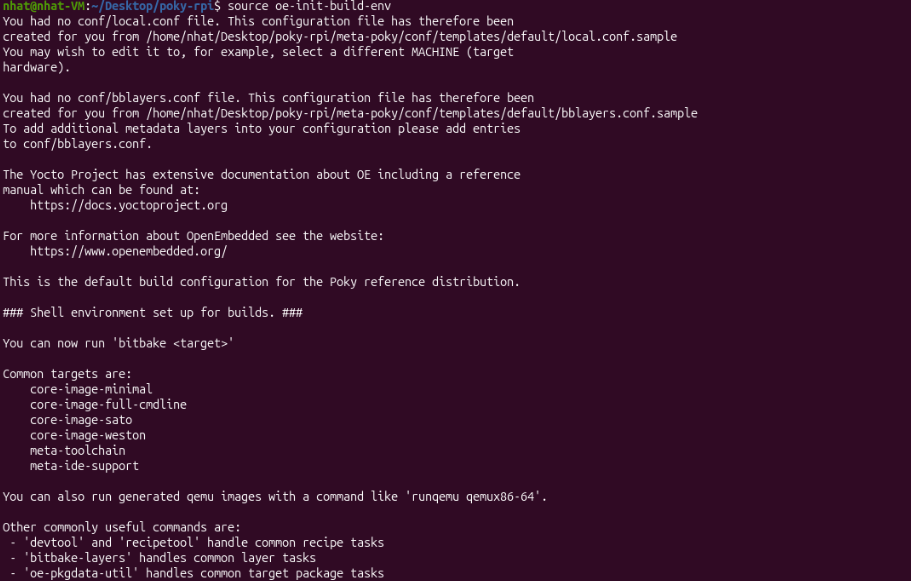

Phần thông báo quan trọng:

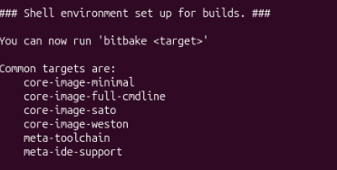

---

## 2. Add `meta-raspberrypi` Layer

Sau khi chạy:

```bash
source oe-init-build-env
```

terminal đang ở:

```text
poky-rpi/build
```

Trong cấu trúc đang dùng, `meta-raspberrypi` nằm ở:

```text
poky-rpi/meta-raspberrypi
```

Vì vậy từ thư mục `build`, thêm layer bằng:

```bash
bitbake-layers add-layer ../meta-raspberrypi
```

> File Word gốc ghi `./meta-raspberrypi`, nhưng ảnh `bblayers.conf` cho thấy layer nằm ở `poky-rpi/meta-raspberrypi`. Khi terminal đang ở `poky-rpi/build`, đường dẫn đúng theo cấu trúc này là `../meta-raspberrypi`.

Lệnh trên dùng chương trình `bitbake-layers`, thực hiện chức năng `add-layer` để đăng ký thư mục `meta-raspberrypi` vào:

```text
build/conf/bblayers.conf
```

Kiểm tra:

```bash
cat conf/bblayers.conf
```

Nếu thấy dòng tương tự:

```text
/home/<user>/Desktop/poky-rpi/meta-raspberrypi \
```

thì Yocto đã biết tới layer Raspberry Pi.

Ảnh minh họa:

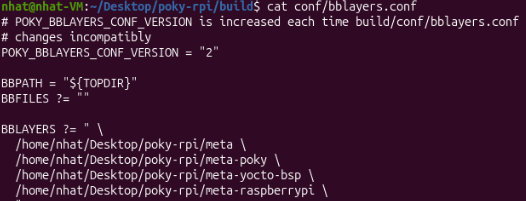

---

# III. Configure `local.conf` for Raspberry Pi 4

Trong thư mục:

```text
poky-rpi/build
```

có thể kiểm tra:

```bash
ls
```

và vào thư mục cấu hình:

```bash
cd conf
ls
```

Ảnh minh họa:

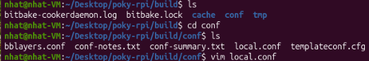

Mở file:

```bash
vim local.conf
```

Hoặc nếu vẫn đang đứng ở `build`:

```bash
vim conf/local.conf
```

Trong Vim:

1. Di chuyển xuống cuối file.
2. Nhấn `i` để vào **Insert Mode**.
3. Thêm các dòng sau:

```conf
MACHINE = "raspberrypi4"
INIT_MANAGER = "systemd"
LICENSE_FLAGS_ACCEPTED = "synaptics-killswitch"
ENABLE_UART = "1"
```

---

## 1. `MACHINE`

```conf
MACHINE = "raspberrypi4"
```

Dòng này cho Yocto biết target phần cứng cần build là **Raspberry Pi 4**.

---

## 2. `INIT_MANAGER`

```conf
INIT_MANAGER = "systemd"
```

`systemd` là init system được kernel khởi chạy rất sớm và trở thành process đầu tiên trong user space với:

```text
PID 1
```

Nó đọc các unit/service và khởi động chúng theo dependency và thứ tự được cấu hình.

Có thể hiểu ngắn gọn:

> `systemd` chịu trách nhiệm đưa hệ thống vào trạng thái hoạt động bằng cách khởi động và quản lý các service như network, SSH, application,... theo dependency/order.

---

## 3. `LICENSE_FLAGS_ACCEPTED`

```conf
LICENSE_FLAGS_ACCEPTED = "synaptics-killswitch"
```

Đây là license flag cần được chấp nhận cho cấu hình/package tương ứng trong quá trình build.

---

## 4. `ENABLE_UART`

```conf
ENABLE_UART = "1"
```

Bật UART để sau này có thể theo dõi quá trình boot và truy cập console của Raspberry Pi thông qua USB-TTL.

---

# IV. Build Linux Image

Quay lại thư mục `build` nếu đang ở `build/conf`:

```bash
cd ..
```

Build image:

```bash
bitbake core-image-base
```

Lệnh này bắt đầu quá trình Yocto:

- xử lý recipe;
- tải source cần thiết;
- biên dịch package;
- tạo root filesystem;
- tạo Linux image cho target `raspberrypi4`.

> File Word gốc có một dòng ghi `raspberrypi3`, nhưng cấu hình `MACHINE` và toàn bộ đường dẫn image đều là `raspberrypi4`, nên ở đây đã sửa thành **Raspberry Pi 4**.

Sau khi build hoàn tất:

```bash
ls -lh tmp/deploy/images/raspberrypi4/
```

Ảnh minh họa output:

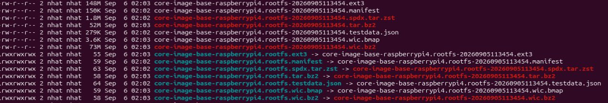

---

## File cần dùng để flash

Trong các file output, chú ý file có đuôi:

```text
.wic.bz2
```

Ví dụ:

```text
core-image-base-raspberrypi4.rootfs-20260905113454.wic.bz2
```

`.bz2` nghĩa là file `.wic` đang được nén bằng bzip2.

---

## Decompress `.wic.bz2`

Giải nén:

```bash
bzcat tmp/deploy/images/raspberrypi4/core-image-base-raspberrypi4.rootfs-20260905113454.wic.bz2 \
> tmp/deploy/images/raspberrypi4/core-image-base-raspberrypi4.rootfs-20260905113454.wic
```

Cú pháp tổng quát:

```bash
bzcat file.wic.bz2 > file.wic
```

Kiểm tra:

```bash
ls -lh tmp/deploy/images/raspberrypi4/*.wic*
```

Ảnh minh họa:

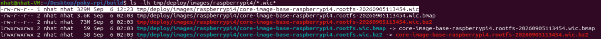

---

# V. Flash Image to SD Card

## 1. Check SD Card Device

Cắm SD card vào máy và chạy:

```bash
lsblk
```

Mục tiêu là xác định thiết bị nào là SD card.

Trong ví dụ của tài liệu, SD card là:

```text
/dev/sdc
```

và partition là:

```text
/dev/sdc1
```

Ảnh trước khi unmount:

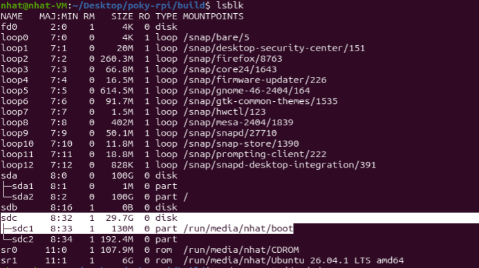

> **CẢNH BÁO:** Tên `/dev/sdc` chỉ là ví dụ từ máy trong tài liệu. Trên máy khác SD card có thể là `/dev/sdb`, `/dev/mmcblk0`,... Phải kiểm tra thật kỹ trước khi dùng `dd`, vì chọn nhầm ổ có thể ghi đè dữ liệu trên ổ hệ thống.

---

## 2. Unmount SD Card Partition

Ubuntu thường tự động mount partition khi cắm SD card.

Trước khi dùng `dd` để ghi full image vào toàn bộ thiết bị, cần unmount partition.

Ví dụ:

```bash
sudo umount /dev/sdc1
```

Nếu SD card có nhiều partition, unmount tất cả partition của nó.

Sau đó kiểm tra lại:

```bash
lsblk
```

Ảnh sau khi unmount:

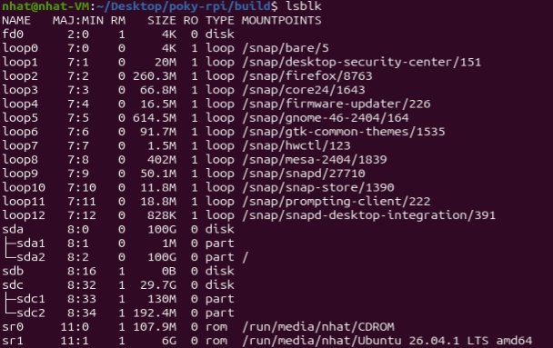

Mục đích:

- Ubuntu ngừng sử dụng partition;
- tránh xung đột khi `dd` ghi trực tiếp lên toàn bộ SD card.

---

## 3. Flash `.wic` Image to SD Card

Dùng:

```bash
sudo dd if=tmp/deploy/images/raspberrypi4/core-image-base-raspberrypi4.rootfs-20260905113454.wic \
of=/dev/sdc bs=4M status=progress conv=fsync
```

Cú pháp tổng quát:

```bash
sudo dd if=<source_file> of=<target_device> bs=<block_size> status=progress conv=fsync
```

Ý nghĩa:

- `dd`: chương trình sao chép dữ liệu ở mức thấp, thường dùng để ghi disk image vào ổ/thẻ nhớ.
- `if=...`: **input file**, ở đây là file `.wic`.
- `of=/dev/sdc`: **output device**, ghi vào toàn bộ SD card.
- `bs=4M`: block size là 4 MB.
- `status=progress`: hiển thị tiến trình ghi.
- `conv=fsync`: đồng bộ dữ liệu output xuống thiết bị lưu trữ trước khi `dd` kết thúc.

Ảnh minh họa quá trình flash:

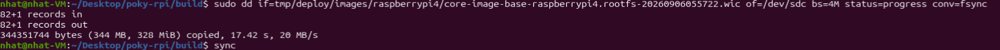

---

## 4. Sync Data

Sau khi `dd` hoàn tất, có thể chạy:

```bash
sync
```

`sync` ép Linux ghi toàn bộ dữ liệu còn nằm trong RAM/cache xuống thiết bị lưu trữ thật.

Sau khi lệnh hoàn tất mới tháo SD card khỏi máy.

---

# VI. Connect Raspberry Pi via UART

Sau khi flash image xong:

1. Gắn SD card vào Raspberry Pi.
2. Kết nối USB-TTL với Raspberry Pi.
3. Dùng `picocom` trên Ubuntu để mở serial console.
4. Cấp nguồn cho Raspberry Pi.

---

## 1. USB-TTL Wiring

Kết nối:

| USB-TTL | Raspberry Pi |
|---|---|
| RX | TX |
| TX | RX |
| GND | GND |

Tức là:

```text
RX  -> TX
TX  -> RX
GND -> GND
```

> Không nối TX với TX hoặc RX với RX.

Sơ đồ GPIO Raspberry Pi trong tài liệu:

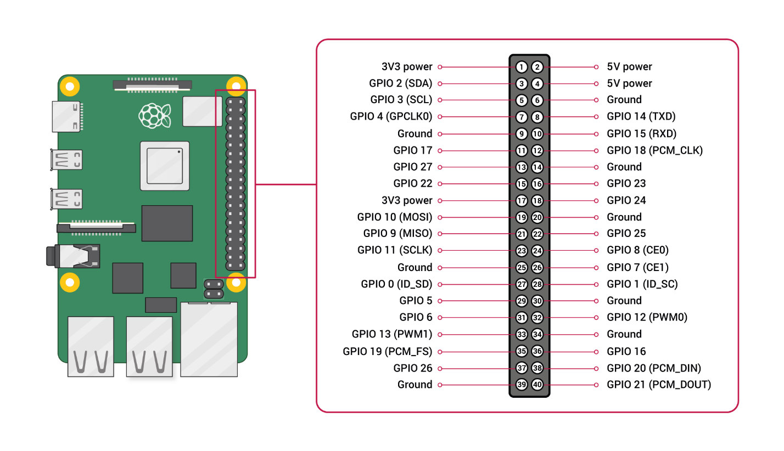

---

## 2. Check USB-TTL

Cắm USB-TTL vào máy tính và chạy:

```bash
ls /dev/ttyUSB*
```

Nếu thiết bị được nhận có thể thấy:

```text
/dev/ttyUSB0
```

Ảnh minh họa:


---

## 3. Open UART Console with Picocom

Chạy:

```bash
sudo picocom -b 115200 /dev/ttyUSB0
```

Trong đó:

- `picocom`: chương trình serial terminal.
- `-b 115200`: baud rate 115200.
- `/dev/ttyUSB0`: thiết bị USB-TTL.

Khi màn hình hiện:

```text
Terminal ready
```

thì picocom đã sẵn sàng.

Ảnh minh họa:

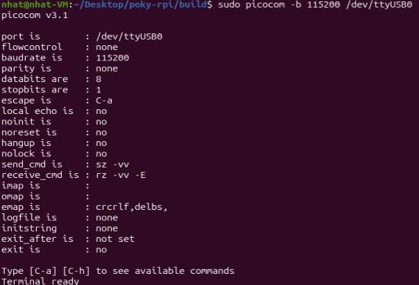

Lúc này cấp nguồn cho Raspberry Pi để theo dõi quá trình boot qua UART.

---

## 4. Login

Sau khi Raspberry Pi boot xong, tại prompt đăng nhập gõ:

```text
root
```

để đăng nhập bằng tài khoản root.

---

# VII. Full Workflow

```text
Clone Poky
    |
    v
Clone meta-raspberrypi
    |
    v
source oe-init-build-env
    |
    v
bitbake-layers add-layer ../meta-raspberrypi
    |
    v
Configure conf/local.conf
    |
    v
MACHINE = "raspberrypi4"
INIT_MANAGER = "systemd"
ENABLE_UART = "1"
    |
    v
bitbake core-image-base
    |
    v
Find .wic.bz2
    |
    v
bzcat -> .wic
    |
    v
lsblk
    |
    v
umount SD partition(s)
    |
    v
dd .wic -> SD card
    |
    v
sync
    |
    v
Insert SD card into Raspberry Pi
    |
    v
Connect USB-TTL
    |
    v
ls /dev/ttyUSB*
    |
    v
picocom -b 115200 /dev/ttyUSB0
    |
    v
Power on Raspberry Pi
    |
    v
Login: root
```

---

# VIII. Command Summary

## Download source

```bash
git clone -b scarthgap https://git.yoctoproject.org/poky poky-rpi
cd poky-rpi
git clone -b scarthgap https://github.com/agherzan/meta-raspberrypi.git
```

## Initialize build environment

```bash
source oe-init-build-env
```

## Add Raspberry Pi layer

```bash
bitbake-layers add-layer ../meta-raspberrypi
```

## Check layer configuration

```bash
cat conf/bblayers.conf
```

## Edit build configuration

```bash
vim conf/local.conf
```

```conf
MACHINE = "raspberrypi4"
INIT_MANAGER = "systemd"
LICENSE_FLAGS_ACCEPTED = "synaptics-killswitch"
ENABLE_UART = "1"
```

## Build

```bash
bitbake core-image-base
```

## Check image output

```bash
ls -lh tmp/deploy/images/raspberrypi4/
```

## Decompress image

```bash
bzcat tmp/deploy/images/raspberrypi4/core-image-base-raspberrypi4.rootfs-20260905113454.wic.bz2 \
> tmp/deploy/images/raspberrypi4/core-image-base-raspberrypi4.rootfs-20260905113454.wic
```

## Check SD card

```bash
lsblk
```

## Unmount SD card

```bash
sudo umount /dev/sdc1
```

## Flash SD card

```bash
sudo dd if=tmp/deploy/images/raspberrypi4/core-image-base-raspberrypi4.rootfs-20260905113454.wic \
of=/dev/sdc bs=4M status=progress conv=fsync
```

## Sync

```bash
sync
```

## Check USB-TTL

```bash
ls /dev/ttyUSB*
```

## Open serial console

```bash
sudo picocom -b 115200 /dev/ttyUSB0
```

## Login

```text
root
```

---

# IX. Notes / Corrections from the Original Document

Các điểm đã được chỉnh để tài liệu nhất quán hơn:

1. `raspberrypi3` trong phần mô tả build được sửa thành `raspberrypi4`, vì `MACHINE` và toàn bộ đường dẫn output đều đang dùng Raspberry Pi 4.
2. `bitbake-layers add-layer ./meta-raspberrypi` được chỉnh thành:

   ```bash
   bitbake-layers add-layer ../meta-raspberrypi
   ```

   khi terminal đang ở `poky-rpi/build` và layer nằm ở `poky-rpi/meta-raspberrypi`.

3. Bổ sung giải thích rõ rằng clone layer chưa có nghĩa Yocto đã sử dụng layer.
4. Giữ bước giải nén `.wic.bz2` thành `.wic` trước khi dùng `dd`.
5. Bổ sung cảnh báo kiểm tra đúng thiết bị SD card trước khi dùng `dd`.
6. Bổ sung nhắc unmount tất cả partition của SD card nếu có nhiều hơn một partition.
7. Giữ bước `sync` sau khi flash để đảm bảo dữ liệu đã được ghi xuống thiết bị lưu trữ.
